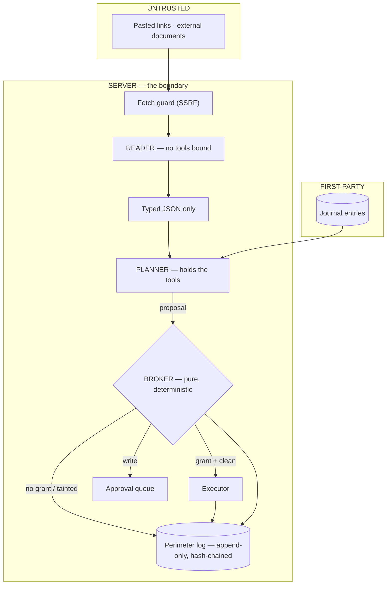

# Perimeter — design record

> **This document is superseded.** An earlier version described a single-model
> architecture with a detection-and-taint pipeline. That design was replaced by the
> **dual-model airlock** during the M3 migration (see `AUDIT.md` for why, and the git
> history for the amendments). Rather than leave a confidently-wrong design doc in the
> repo, the current design is documented where it stays accurate:

| For | See |
|---|---|
| What it defends against, the measured result, honest limits | [`README.md`](README.md) |
| The threat model, all seventeen invariants, and their amendments | [`CONSTITUTION.md`](CONSTITUTION.md) |
| The pre-migration audit that motivated the rework | [`AUDIT.md`](AUDIT.md) |
| Threat Summary Tables by zone | [`docs/threat-model.md`](docs/threat-model.md) |
| The scheduled-ingest / OIDC setup | [`docs/scheduler-setup.md`](docs/scheduler-setup.md) |

## The architecture in one screen

The load-bearing property: the model that reads untrusted text (**Reader**) has no tools,
and the model that has tools (**Planner**) never reads raw untrusted text. An injection
therefore reaches a context with nothing to call. The **Broker** — a pure function with no
model in it — decides every action against a capability the user granted. Every decision is
recorded in an append-only, hash-chained log the client cannot write to.

Seventeen numbered invariants govern this; they live in [`CONSTITUTION.md`](CONSTITUTION.md) §2
and are referenced by the code, the tests, and the log.
